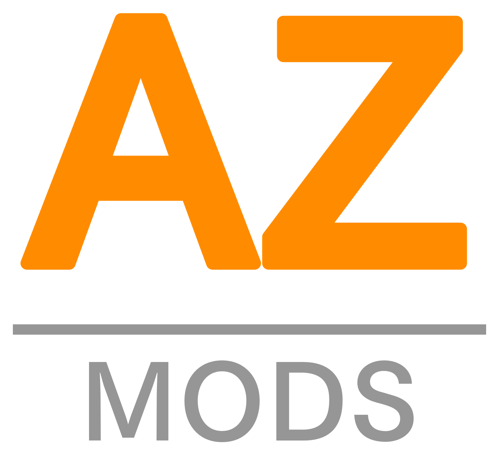
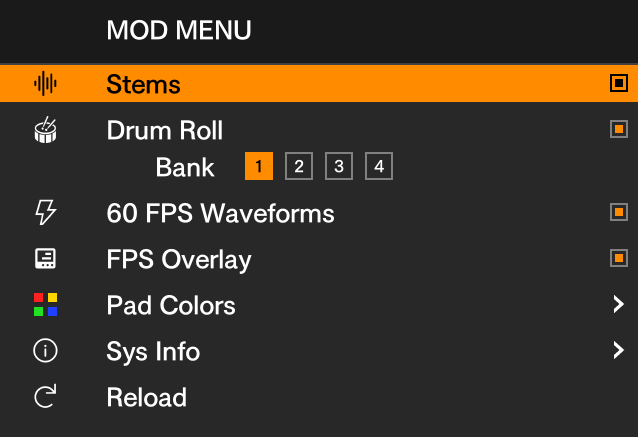
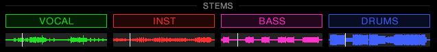
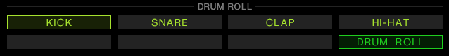
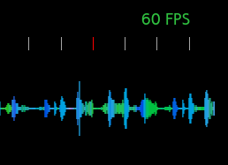
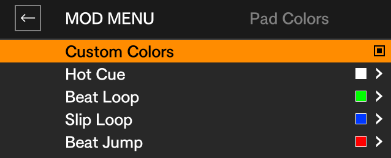

**Root Access & Mods for the XDJ-AZ**

[**Download**](../../releases) · [Install](#install) · [Features](#features) · [How it works](#how-it-works) · [Safety](#safety) · [FAQ](#faq) · [Developers](#developers)

 

> [!CAUTION]
> This modifies your XDJ-AZ's firmware. I've tested it on my own hardware and the
> chance of bricking is low, but it is not zero: the only real danger is losing power
> during the firmware flash, so don't unplug the deck until the update has
> finished.\
> **USE AT YOUR OWN RISK.**

 

## Install

> [!NOTE]
> Before you start, download the stock **XDJAZv130.UPD** from AlphaTheta's
> support site.

1. **Get the AZ-MODS desktop app** (Mac or Windows) from the [releases page](../../releases).

2. **Patch the firmware (once).** In the desktop app, open the *Install* tab,
   drop in your stock `XDJAZv130.UPD`, select your USB stick and click
   **Build & write to USB**. On the deck: power off, put the stick in
   **USB 1**, hold **deck 2's BEAT SYNC + MASTER** while powering on, and run
   the update.

3. **Choose your mods.** Select your music stick in the desktop app, tick the
   mods you want and click **Install to stick**. Boot the deck with that stick
   in and the mods load. Boot with a stick that has no mods, or no stick at
   all, and the deck is stock.

4. **Make stems, add samples.** Right-click tracks or playlists in the desktop
   app to render stems, and add your drum samples to a bank. Eject and play.

Future mod updates only need to update the files in the `MODS` folder on your
USB, and are supplied through the desktop app. After the first firmware flash,
you shouldn't ever have to flash again.

 

## Features

| Mod | What it does |
|:--|:--|
| [**Mod Menu**](#mod-menu) | Toggle every mod, pick colors and banks, right from the deck's SOURCE list |
| [**Stems**](#stems) | VOCAL · MELODY · BASS · DRUMS on the pads, through the deck's native audio path |
| [**Drum Roll**](#drum-roll) | A sample roll instrument on the X-PAD, locked to the deck's BPM |
| [**60 FPS Waveforms**](#60-fps-waveforms) | Lifts the stock ~30 FPS waveform cap to 60 |
| [**Pad Colors**](#pad-colors) | Your own color for each pad-mode button |

### Mod Menu

The home for every mod, right in the deck's SOURCE list. Scroll to **MOD
MENU** with the browse knob to switch features on and off, pick pad colors
and choose a drum-roll bank, all without leaving the deck. Your settings are
remembered between sessions, and future mods show up here too.

### Stems

Four stems per deck: **VOCAL · MELODY · BASS · DRUMS** on the pads. The mix
runs through the deck's own audio path, so key shift, master tempo, keylock,
scratching and slip work on stems like they do on the full track. Stems are
rendered by the desktop app and stored in a `STEMS` folder on your USB with
your music. Tracks without stems play as normal.

### Drum Roll

A sample roll instrument on the X-PAD. In SLIP LOOP mode, **pad 8** arms it
(red off, green on). Pads 1-4 pick **kick · snare · clap · hi-hat**. The six
X-PAD zones set the rate, **1 to 1/32** of a beat, locked to the deck's BPM.
Four banks of your own samples.

### 60 FPS Waveforms

Stock repaints at about 30 FPS. This lifts the cap to 60. It won't hold 60
under every load, but it's no longer limited. An optional overlay shows the
measured rate.

### Pad Colors

Pick your own color for each pad-mode button (HOT CUE, BEAT LOOP, SLIP LOOP,
BEAT JUMP).

### Other Mods

I have tons of other ideas for more mods, the ones listed above are just what's
included for the v1.0 release. This is only the beginning!

 

## How it works

- **The firmware patch installs a mod loader, not the mods.** On every boot,
  the loader checks the stick's `MODS` folder and makes sure exactly what's
  there is what's running. The deck keeps a copy of the last set only so the
  usual boot with the same stick is instant.
- **No firmware is redistributed.** The desktop app ships a small patch plus the
  hashes of the input and output. You supply the stock file. Anything
  unrecognized is refused.

## Safety

- **Off switch without reflashing.** If a mod misbehaves or the deck won't
  boot cleanly, flip *Disable mods* for your stick in the desktop app and
  power-cycle, or just boot without the stick. The deck boots stock either way.
- **Stock recovery always works.** Update mode is untouched. Flash the stock
  `XDJAZv130.UPD` the same way and the deck is stock again. To also put the
  original boot logo back, add an empty `logo.restore` file to `MODS` and
  boot once before you flash.

 

## FAQ

<b>Other AlphaTheta decks?</b>

 
No, XDJ-AZ only. The patcher refuses anything else.

<b>How good are the stems?</b>

 
They're rendered ahead of time on your computer, not in realtime on the deck.
v1.0 uses a balanced separation model: good, clean stems without too long of a
process time per track. Swapping to other models and quality settings from
within the desktop app is planned.

<b>Will an official update remove it?</b>

 
Yes. Flashing stock returns the deck to stock.

<b>Do I need the mods on the USB stick every time?</b>

 
Yes. The mods load from the stick that's in when the deck boots.

<b>Two sticks with mods?</b>

 
The one in USB 1 takes priority.

<b>Does it affect my music library?</b>

 
The app adds three folders to your drive, for the mods, stems and drum samples.
Your music library is not affected.

 

## Developers

SSH for root shell access can be enabled from the stick with key-pair
authentication: the AZ-MODS desktop app has a box to tick for this, it
essentially adds `MODS/ssh.enable` and an `authorized_keys` file containing
your **ECDSA** public key.
The SSH service comes up after the deck's UI is loaded, and is gone when the
stick isn't present/doesn't have the enable and keys files at boot.

Mod sources, the emulator they're developed on and the research notes will be
published in the next couple weeks.

I plan on making the mod menu a centralized manager for downloading
community-made mods as well (think like iOS jailbreak scene's Cydia app). Where
users will eventually be able to add repos hosted by other mod creators to
download and install their mods, all directly on the deck!

Have fun!

 

## More from the author

AZ-MODS is free and will stay free. It is also proof of a bigger idea I have
been chasing for years: that DJ software can be more capable, more fun, and
less restricted than what we currently settle for.

That idea became **MixRack**, a DJ app I have been building for a long time. If
this project resonates with you, take a look: [mixrack.net](https://mixrack.net)

---

  
  Not affiliated with AlphaTheta, Pioneer DJ or rekordbox; trademarks belong to their owners. 
  MIT license, see <a href="LICENSE">LICENSE</a>. Built by <a href="https://github.com/Kyle-Hosman">Kyle Hosman</a>.
  

