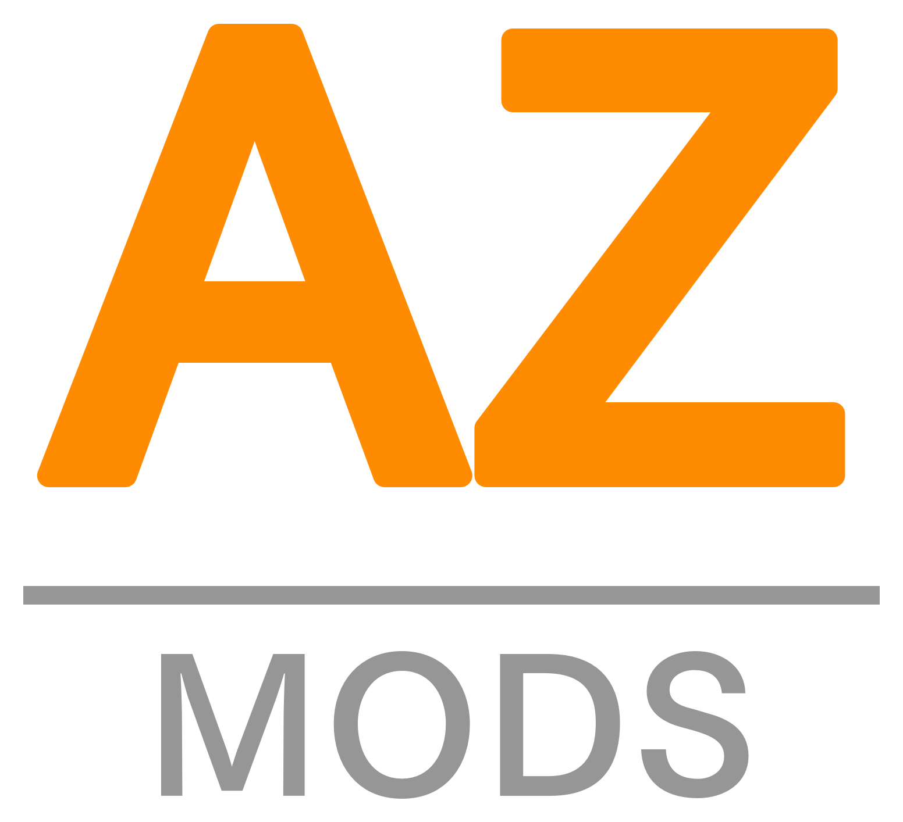
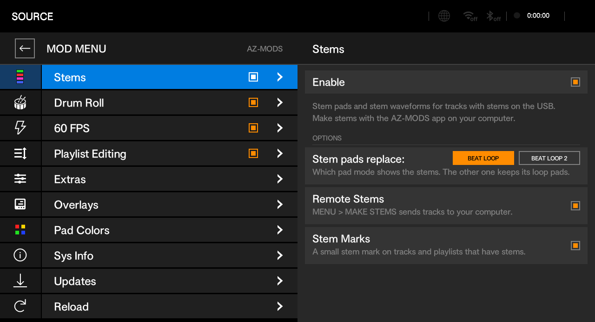
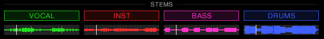
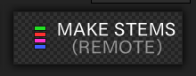
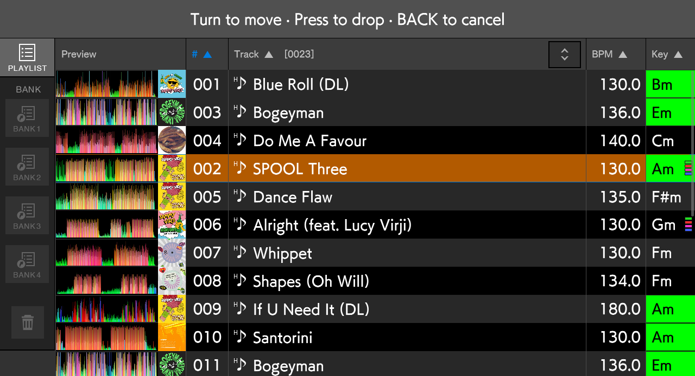
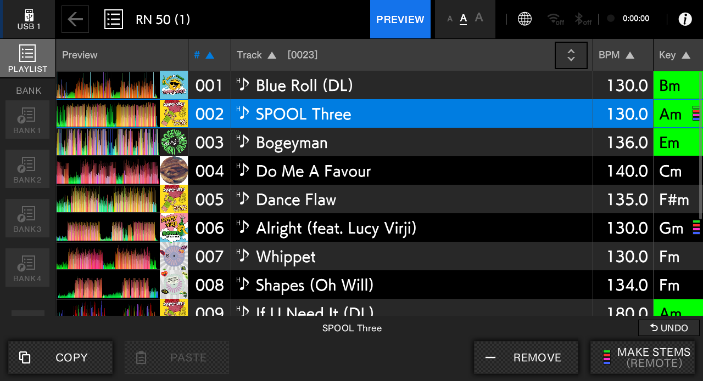
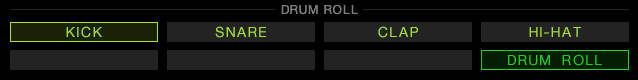
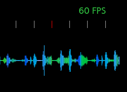
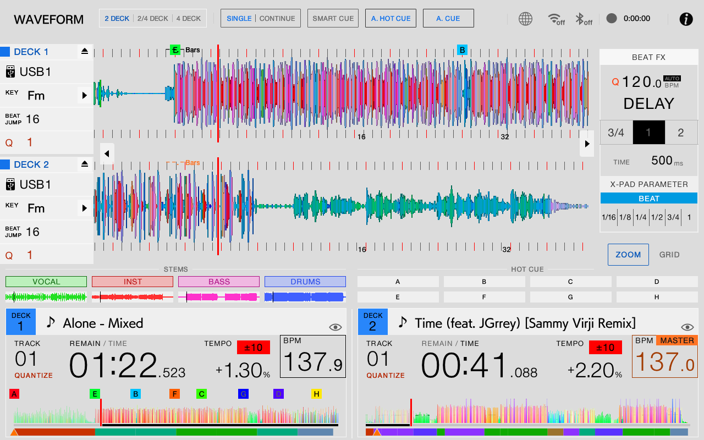

**Root Access & Mods for the XDJ-AZ**

[**Download**](../../releases) · [Install](#install) · [Features](#features) · [How it works](#how-it-works) · [Safety](#safety) · [FAQ](#faq) · [Developers](#developers)

 

> [!CAUTION]
> This modifies your XDJ-AZ's firmware. I've tested it on my own hardware and the
> chance of bricking is low, but it is not zero: the only real danger is losing power
> during the firmware flash, so don't unplug the deck until the update has
> finished.\
> **USE AT YOUR OWN RISK.**

 

## Install

> [!NOTE]
> Before you start, download the stock **XDJAZv200.UPD** (firmware 2.00) from
> AlphaTheta's support site.
> ALSO, make sure the USB you're using to flash the modded firmware is
> formatted to <b>FAT32</b>.

1. **Get the AZ-MODS desktop app** (Mac or Windows) from the [releases page](../../releases).

2. **Patch the firmware (once).** In the desktop app, open the *Install* tab,
   drop in your stock `.UPD`, select your USB stick and click
   **Build & write to USB**. This builds AZ-MODS firmware **2.01**. On the deck: power off, put the stick in
   **USB 1**, hold **deck 2's BEAT SYNC + MASTER** while powering on, and run
   the update.

3. **Choose your mods.** Select your music stick in the desktop app, tick the
   mods you want and click **Install to stick**. Boot the deck with that stick
   in and the mods load. Boot with a stick that has no mods, or no stick at
   all, and the deck is stock.

4. **Make stems, add samples.** Right-click tracks or playlists in the desktop
   app to render stems, and add your drum samples to a bank. Eject and play.

Future mod updates only need to update the files in the `MODS` folder on your
USB, and are supplied through the desktop app/in the Updates section of the mod menu itself. After the first firmware flash,
you shouldn't ever have to flash again.

> [!NOTE]
> When the mod loader is loading mods(for the first time, or after an update), you will see a  **black screen** after the
> device boots, **this is normal**, just wait a few seconds while it loads the mods.

 

## Uninstall

**Just want the deck stock for a gig?** Boot without the stick, or flip
*Disable mods* for your stick in the desktop app and power-cycle. Nothing else
is needed.

**Removing AZ-MODS completely:**

1. **Clean the deck first, while it's still on the modded firmware.** In the
   desktop app, open *Install / Uninstall*, select your USB stick, and under
   **Uninstall** tick **Uninstall AZ-MODS from the deck on the next
   power-cycle**.

2. **Power-cycle the deck with that stick in USB 1.** On this boot the deck
   removes every AZ-MODS file it stored.

3. **Check the result.** Put the stick back in your computer. The app shows
   **No AZ-MODS files remain on the deck. You can now flash the stock
   firmware.** If it lists anything still on the deck, leave the box ticked
   and power-cycle once more.

4. **Flash the stock firmware.** Put the stock `XDJAZv200.UPD` on a USB stick
   and flash it the same way you installed: power off, stick in **USB 1**,
   hold **deck 2's BEAT SYNC + MASTER** while powering on, and run the update.

Your deck is now exactly as it started before modding.

 

## Features

| Mod | What it does |
|:--|:--|
| [**Mod Menu**](#mod-menu) | Every mod and its settings in one full-screen menu, right from the deck's SOURCE list |
| [**Stems**](#stems) | VOCAL · MELODY · BASS · DRUMS on the pads, through the deck's native audio path |
| [**Remote Stems**](#remote-stems) | Make stems for a track or a whole playlist from the deck, sent to your computer over WiFi |
| [**Playlist Editing**](#playlist-editing) | Move, copy, paste, rename and remove tracks, playlists and folders on the deck |
| [**Drum Roll**](#drum-roll) | A sample roll instrument on the X-PAD, locked to the deck's BPM |
| [**60 FPS Waveforms**](#60-fps-waveforms) | Lifts the stock ~30 FPS waveform cap to 60 |
| [**Themes**](#themes) | A light Day theme for bright rooms, plus four dark color themes |

### Mod Menu

The home for every mod, right in the deck's SOURCE list: switch features on
and off and change their settings, with a short description of each. Your
settings are remembered, and future mods show up here too.

### Stems

Four stems per deck: **VOCAL · MELODY · BASS · DRUMS** on the pads. The mix
runs through the deck's own audio path, so key shift, master tempo, keylock,
scratching and slip work on stems like they do on the full track. Stems are
rendered by the desktop app and stored in a `STEMS` folder on your USB with
your music. Tracks without stems play as normal.

Tracks and playlists that have stems show a small stem mark in the track
lists, so you can see at a glance what is ready. It can be turned off under
**Stems** in the Mod Menu.

### Remote Stems

Make stems without leaving the deck. Press **MENU** on a track, a playlist or
the Tag List and choose **MAKE STEMS**: the deck sends the tracks to the
AZ-MODS app on your computer over WiFi, the app makes the stems, and they land
back on your USB. The stem mark animates while a track waits and while its
stems are made.

Turn on **Remote Stems** once in the desktop app, plug your USB into that
computer once so the deck knows where to send its tracks, and keep the app
open while it works. The deck and the computer need to be on the same network.

### Playlist Editing

Edit your USB playlists right on the deck. Hold the browse knob down for a
second to **grab** a track, turn the knob to move it, and press again to
**drop** it. It works for playlists and folders too.

Press **MENU** on a track, playlist or folder for the rest:

- **COPY** and **PASTE**, also from one USB to another (tracks are copied with
  their analysis, cues and artwork)
- **NEW PLAYLIST** and **NEW FOLDER**, named with the on-screen keyboard
- **RENAME** and **REMOVE**
- **SELECT** a playlist, then **ADD TO** from any list, including Search
- **UNDO** your recent edits, one at a time

Edits are written the way rekordbox expects, so your USB stays in step with
rekordbox. Turn it on under **Playlist Editing** in the Mod Menu.

### Drum Roll

A sample roll instrument on the X-PAD. In SLIP LOOP mode, **pad 8** arms it
(red off, green on). Pads 1-4 pick **kick · snare · clap · hi-hat**. The six
X-PAD zones set the rate, **1 to 1/32** of a beat, locked to the deck's BPM.
Four banks of your own samples.

The **MIC 2** EQ knobs shape the roll on both decks. **HI** is the volume:
12 o'clock is the normal level, turn left to fade it out or right for up to
+6 dB. **MID** is the pitch: 12 o'clock is the sample's own pitch, and the ends
are an octave down or up.

### 60 FPS Waveforms

Stock repaints at about 30 FPS. This runs the waveforms at the screen's full
60 FPS, in the 2-deck and 4-deck views alike. Its **60 FPS UI** option also
makes scrolling the track lists smoother. An optional overlay shows the
measured rate.

### Themes

Change the look of the whole deck screen. **Day** is a light theme that stays
easy to read in bright rooms and outdoor sets, and **AZ-MODS**, **Midnight**,
**Ember** and **Forest** are dark themes, each with its own accent color.
Waveform, stem and cue colors keep their meaning in every theme. Pick one under
**Themes** in the Mod Menu: it switches instantly, with no reload.

### Other Mods

Smaller tweaks, each with its own switch in the Mod Menu (most of them under
**Extras**):

| Mod | What it does |
|:--|:--|
| **Phase Meter** | Shows how the two decks line up, beat by beat, above their waveforms |
| **Hide Track Title** | Tap a deck's track title to hide it or show it again |
| **BEAT JUMP 2 First** | BEAT JUMP opens the 8, 16, 32 and 64 beat jumps first |
| **Fine Vinyl Speed Adjust** | The SHORTCUT vinyl speed steps become a 1% slider |
| **Bluetooth Auto-Connect** | Connects to the paired device when Bluetooth starts |
| **Remember Selected Channel** | Your Bluetooth channel is set again when a device connects |
| **Pad Colors** | Your own color for each pad-mode button (HOT CUE, BEAT LOOP, SLIP LOOP, BEAT JUMP) |
| **Overlays** | Small readouts on the deck screen: FPS, CPU use and clock, RAM and temperature |

I have tons of other ideas for more mods. This is only the beginning!

 

## How it works

- **The firmware patch installs a mod loader, not the mods.** On every boot,
  the loader checks the stick's `MODS` folder and makes sure exactly what's
  there is what's running. The deck keeps a copy of the last set only so the
  usual boot with the same stick is instant.
- **No firmware is redistributed.** The desktop app ships a small patch plus the
  hashes of the input and output. You supply the stock file. Anything
  unrecognized is refused.

## Safety

- **Off switch without reflashing.** If a mod misbehaves or the deck won't
  boot cleanly, flip *Disable mods* for your stick in the desktop app and
  power-cycle, or just boot without the stick. The deck boots stock either way.
- **Stock recovery always works.** Update mode is untouched. Flash the stock
  `XDJAZv200.UPD` the same way and the deck is stock again.
- **Crash protection.** If the mods ever keep crashing the deck right after it
  starts, the deck switches them off and starts normally until the mods on the
  USB change.

 

## FAQ

<b>I'm on AZ-MODS 1.32. How do I get 2.01?</b>

 
Build 2.01 from the stock <code>XDJAZv200.UPD</code> in the desktop app and flash
it the same way as before. The app also updates the mods on your USB if they are
too old for 2.01.

<b>Other AlphaTheta decks?</b>

 
No, XDJ-AZ only. The patcher refuses anything else.

<b>How good are the stems?</b>

 
They're rendered ahead of time on your computer, not in realtime on the deck.
The desktop app's **Stem Quality** setting picks the trade-off: **Medium** (the
default) is fast and clean, **High** and **Very High** take longer for better
separation. Tracks made at a lower quality can be upgraded from the app.

<b>Will an official update remove it?</b>

 
Yes, flashing stock firmware removes the mods. To also clear the files AZ-MODS
stored on the deck, run the [Uninstall](#uninstall) steps before you flash.

<b>Do I need the mods on the USB stick every time?</b>

 
Yes. The mods load from the stick that's in when the deck boots.

<b>Two sticks with mods?</b>

 
The one in USB 1 takes priority.

<b>Does it affect my music library?</b>

 
The app adds three folders to your drive, for the mods, stems and drum samples.
Your music library is only changed when you edit playlists on the deck with
Playlist Editing, and those edits are written the way rekordbox expects.

 

## Developers

SSH for root shell access can be enabled from the stick with key-pair
authentication: the AZ-MODS desktop app has a box to tick for this, it
essentially adds `MODS/ssh.enable` and an `authorized_keys` file containing
your **ECDSA** public key.
The SSH service comes up after the deck's UI is loaded, and is gone when the
stick isn't present/doesn't have the enable and keys files at boot.

Mod sources, the emulator they're developed on and the research notes will be
published soon*

I plan on making the mod menu a centralized manager for downloading
community-made mods as well (think like iOS jailbreak scene's Cydia app). Where
users will eventually be able to add repos hosted by other mod creators to
download and install their mods, all directly on the deck!

Have fun!

 

## More from the author

AZ-MODS is free and will stay free. It is also proof of a bigger idea I have
been chasing for years: that <ins>DJ software can be more capable, more fun, and
less restricted than what we currently settle for.</ins>

That idea became **MixRack**, a DJ app I have been building for a long time. If
this project resonates with you, take a look: [mixrack.net](https://mixrack.net)

 

### Support the project

If you enjoy the benefits that AZ-MODS gives you and would like to say thanks, you can support me on Ko-Fi below: 
(Donations help fund development, and never unlock anything)

 

---

  
  Not affiliated with AlphaTheta, Pioneer DJ or rekordbox; trademarks belong to their owners. 
  MIT license, see <a href="LICENSE">LICENSE</a>. Built by <a href="https://github.com/Kyle-Hosman">Kyle Hosman</a>.
  

